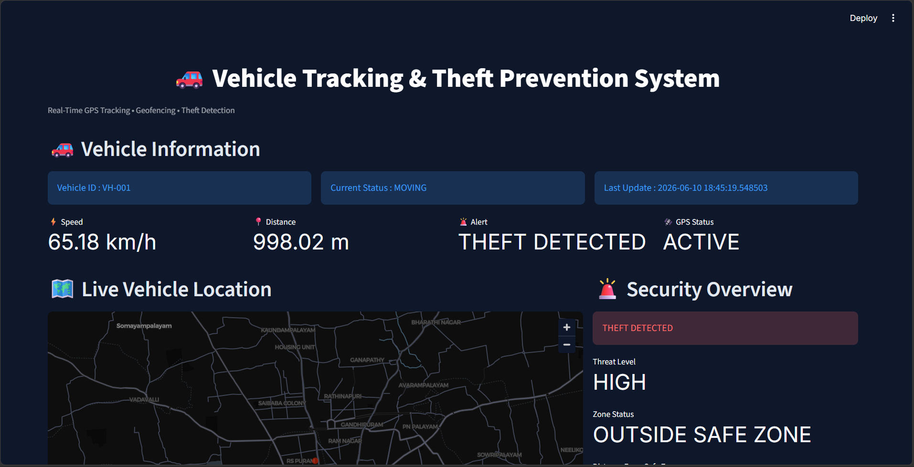
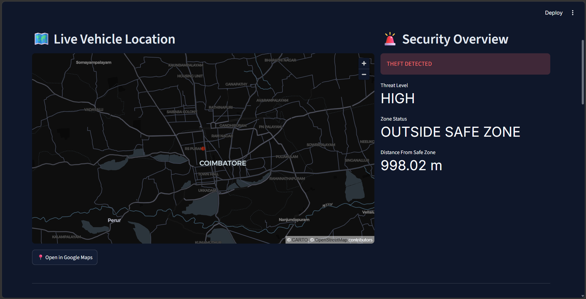
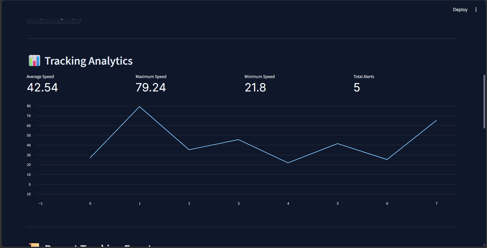
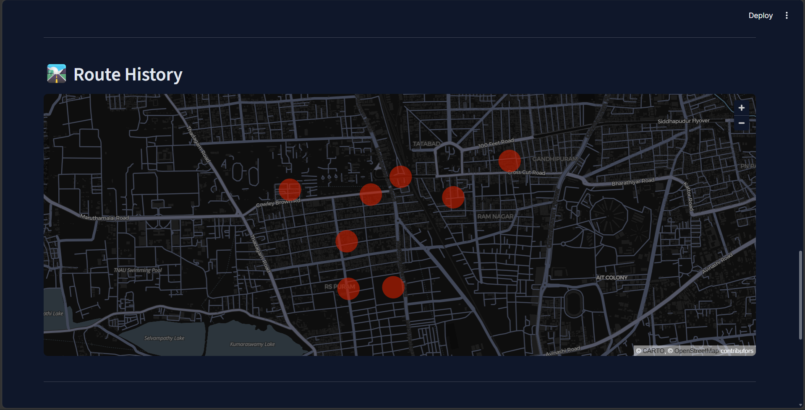
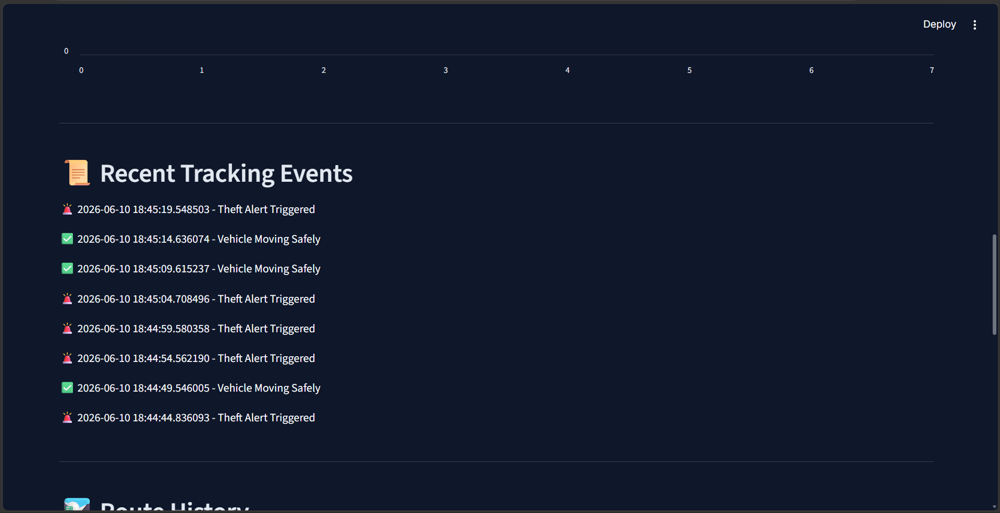
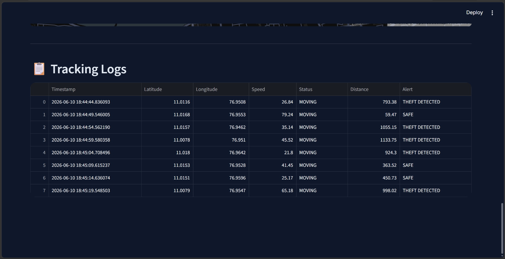

# 🚗 IoT Vehicle Tracking & Theft Prevention System

A real-time IoT-based Vehicle Tracking & Theft Prevention System designed to monitor vehicle movement, detect unauthorized activity, and provide live location tracking through MQTT communication, geofencing, cloud integration, and an interactive dashboard.

This project simulates a smart vehicle security solution capable of tracking GPS coordinates, monitoring vehicle status, detecting theft attempts using geofence boundaries, and visualizing vehicle data through a modern Streamlit dashboard.

---

## 📌 Project Overview

Vehicle theft and unauthorized vehicle movement are major concerns in transportation and logistics. This project addresses these challenges by integrating GPS simulation, MQTT messaging, geofencing, cloud analytics, and dashboard visualization into a single intelligent monitoring platform.

The system continuously tracks vehicle movement, logs GPS data, detects geofence violations, and alerts when suspicious movement occurs.

---

## ✨ Features

### 🚗 Real-Time Vehicle Tracking

* Live GPS location monitoring
* Real-time vehicle status updates
* Continuous movement tracking

### 📡 MQTT Communication

* Publisher–Subscriber architecture
* Real-time data transmission
* Lightweight IoT messaging protocol

### 🚨 Theft Detection

* Geofence-based monitoring
* Safe zone violation detection
* Automatic theft alert generation

### 🗺️ Route Monitoring

* Vehicle route visualization
* Historical route tracking
* Location mapping

### 📊 Tracking Analytics

* Average speed analysis
* Maximum speed monitoring
* Minimum speed monitoring
* Alert statistics

### ☁️ ThingSpeak Cloud Integration

* Real-time cloud data storage
* IoT analytics platform integration
* Remote monitoring support

### 📋 Data Logging

* CSV-based tracking logs
* Historical movement records
* Event tracking

### 🎨 Interactive Dashboard

* Modern Streamlit interface
* Live vehicle map
* Security overview
* Tracking analytics
* Activity feed

---

## 🛠️ Technology Stack

### Programming Language

* Python

### IoT & Communication

* MQTT
* Paho MQTT

### Dashboard & Visualization

* Streamlit
* Pandas

### Cloud Platform

* ThingSpeak

### Data Storage

* CSV Logging

### Development Tools

* Git
* GitHub
* VS Code

---

## 📂 Project Structure

```text
IoT-Vehicle-Tracking-Theft-Prevention-System/

├── arduino_code/
│
├── dashboard/
│   └── app.py
│
├── data/
│   └── gps_logs.csv
│
├── images/
│   ├── dashboard_home.png
│   ├── live_tracking_security_overview.png
│   ├── recent_tracking_events.png
│   ├── route_history.png
│   ├── tracking_analytics.png
│   └── tracking_logs.png
│
├── mqtt/
│   ├── mqtt_publisher.py
│   └── mqtt_subscriber.py
│
├── outputs/
│
├── simulation/
│   ├── geofence.py
│   ├── geofence_monitor.py
│   ├── gps_simulator.py
│   └── theft_simulator.py
│
├── thingspeak/
│   ├── __init__.py
│   └── thingspeak_sender.py
│
├── main.py
├── requirements.txt
└── README.md
```

---

## ⚙️ System Architecture

```text
GPS Simulator
      │
      ▼
 MQTT Publisher
      │
      ▼
   HiveMQ Broker
      │
      ▼
 MQTT Subscriber
      │
      ├────────► CSV Logging
      │
      ├────────► Geofence Monitoring
      │
      ├────────► Theft Detection
      │
      └────────► ThingSpeak Cloud
                       │
                       ▼
             Streamlit Dashboard
```

---

## 📸 Dashboard Screenshots

### 🏠 Dashboard Home



---

### 📍 Live Tracking & Security Overview



---

### 📊 Tracking Analytics



---

### 🛣️ Route History



---

### 📜 Recent Tracking Events



---

### 📋 Tracking Logs



---

## 🚀 Installation

### Clone Repository

```bash
git clone https://github.com/VaishnavaDevi-R/IoT-Vehicle-Tracking-Theft-Prevention-System.git

cd IoT-Vehicle-Tracking-Theft-Prevention-System
```

### Create Virtual Environment

```bash
python -m venv venv
```

### Activate Environment

#### Windows

```bash
venv\Scripts\activate
```

#### Linux / macOS

```bash
source venv/bin/activate
```

### Install Dependencies

```bash
pip install -r requirements.txt
```

---

## ▶️ Running the Project

### Start MQTT Subscriber

```bash
python mqtt/mqtt_subscriber.py
```

### Start MQTT Publisher

```bash
python mqtt/mqtt_publisher.py
```

### Launch Dashboard

```bash
streamlit run dashboard/app.py
```

---

## 🚨 Theft Detection Logic

1. Vehicle GPS coordinates are continuously generated.
2. Coordinates are compared against a predefined safe zone.
3. Distance from the safe zone is calculated.
4. If the vehicle exits the permitted radius:

   * Theft alert is triggered.
   * Alert is logged.
   * Cloud platform is updated.
5. Dashboard displays the threat status in real time.

---

## 📈 Key Functionalities

* Real-Time GPS Tracking
* Vehicle Monitoring
* Route History Analysis
* Geofence Monitoring
* Theft Detection
* MQTT Communication
* Cloud Integration
* Interactive Dashboard
* Data Logging
* Security Alerts

---

## 🔮 Future Enhancements

* Telegram Alert Notifications
* SMS-Based Theft Alerts
* Real GPS Hardware Integration
* Multiple Vehicle Tracking
* Mobile Application Support
* Driver Authentication
* AI-Based Theft Prediction
* Route Optimization
* Fleet Management Module
* Real-Time Notification System

---

## 👨‍💻 Author

**Vaishnava Devi**

---

## ⭐ Support

If you found this project useful:

⭐ Star the repository

🍴 Fork the project

📢 Share your feedback

🚀 Connect and collaborate

```
```
